 

  <h3 align="center">Distributed YouTube Website</h3>
  <h4>Distributed System Final Assessment @ Sunway University</h5>
	 <h5>By Tye Khan Ren, Ho Chun Kian, Lai Meng Hin & Ivan Lou Han Rong</h5>
		<h5>Special Thanks to Gracelyn Chong Wen Hui</h5>

 

## Description
Distributed YouTube Website is the final assessment project for the Distributed Systems subject within the BSc (Hons) Information Technology (Computer Networking and Security) program at Sunway University. The team comprised<a href="https://github.com/khanren">Tye Khan Ren</a>, <a href="https://github.com/bawskii">Ho Chun Kian</a>, <a href="https://github.com/auscalai">Lai Meng Hin</a>, <a href="https://github.com/IvanLHR">Ivan Lou Han Rong</a>. We extend our sincere thanks to <a href="https://github.com/cwhui1001">Gracelyn Chong Wen Hui</a> for her contributions to the UI/UX design. 

The platform is built using HTML, CSS, JavaScript, Firebase, and the YouTube API. It provides a user-friendly interface, enabling users to upload and watch videos directly on the website. We chose Firebase for its distributed nature, leveraging it for authentication, real-time database, and storage to enhance the distributed characteristics of our website.

 

## Signup Page

  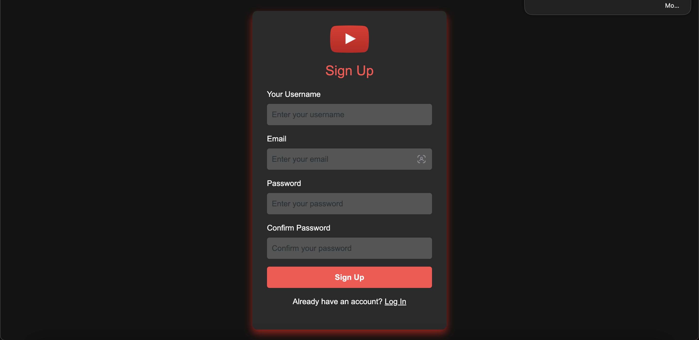

 

## Login Page

  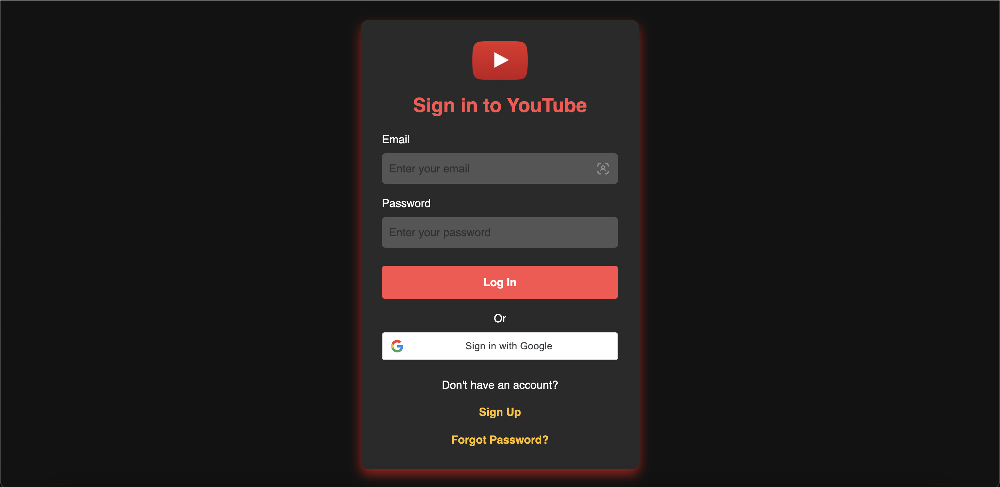

 

## Reset Password Page

  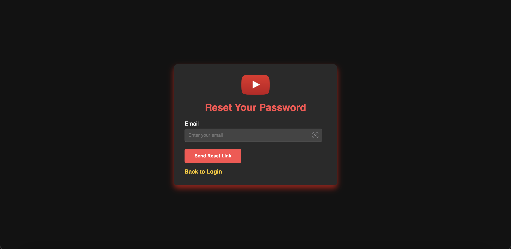

 

## Homepage

  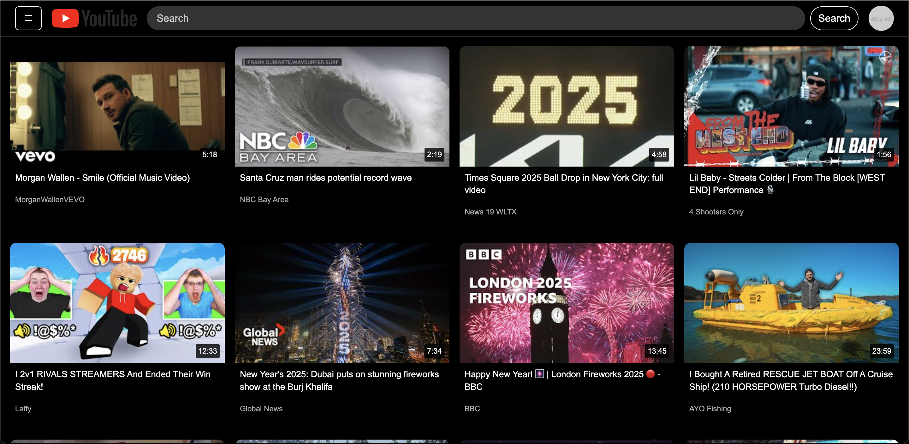

 

## User Profile

  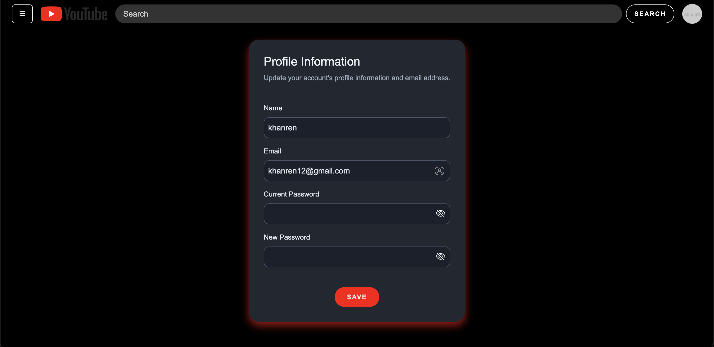

 

## Play Video

  

 

## Share

  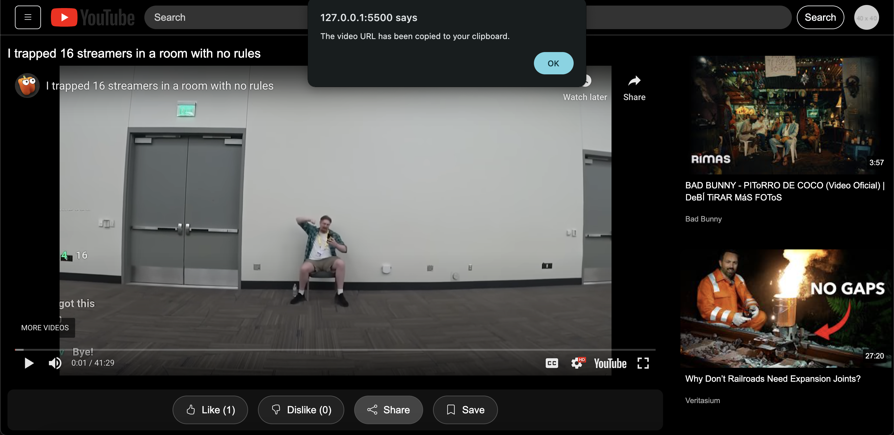

 

## Video Title and Description

  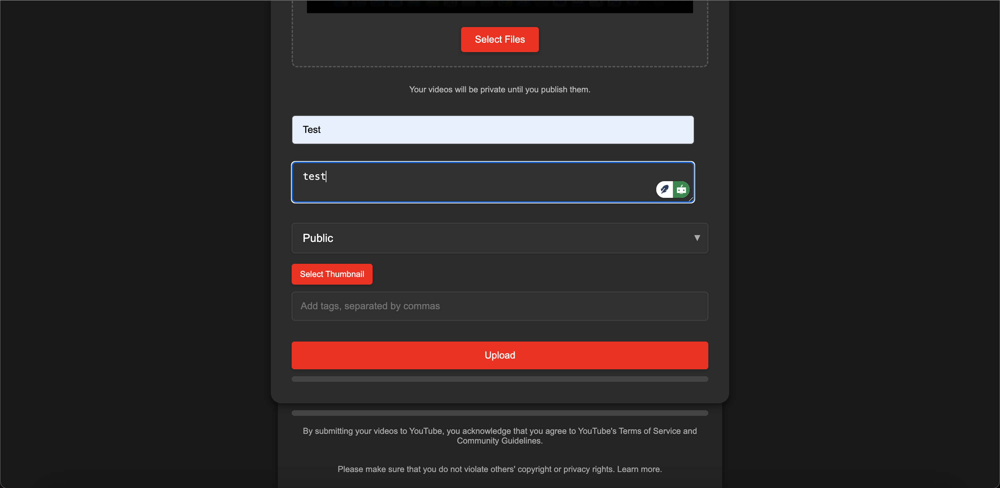

 

## Description and Comments

  

 

## Comment Delete Confirmation

  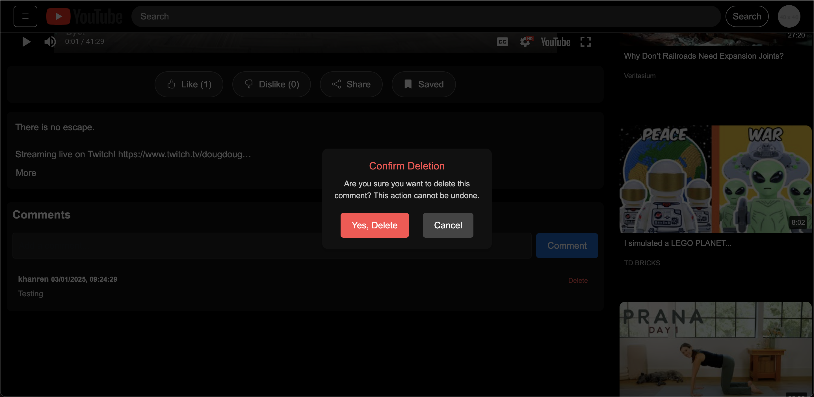

 

## Upload and Preview Video

  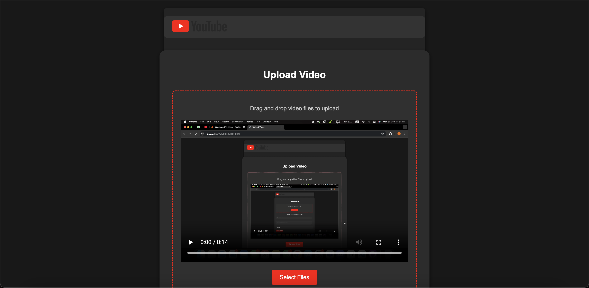

 

## Uploaded Video Delete Confirmation

  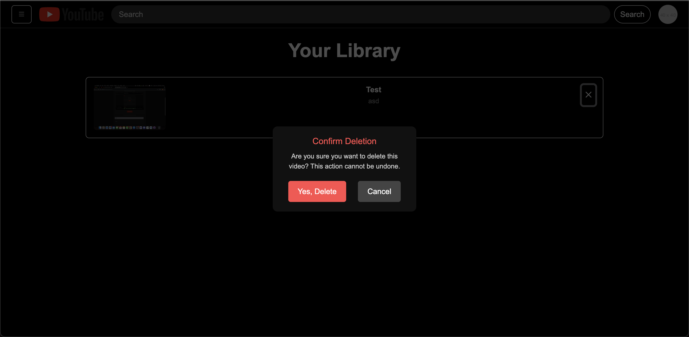

 

## Library

  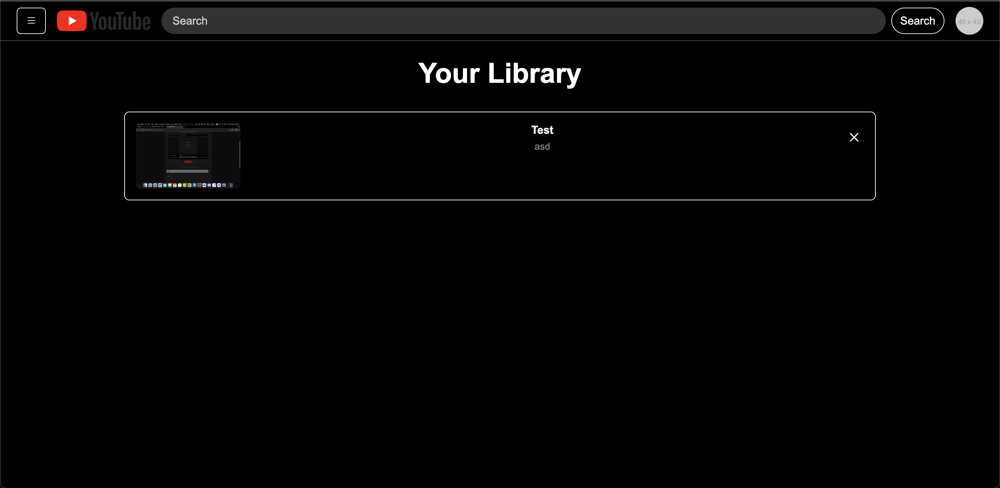

 

## Watched History

  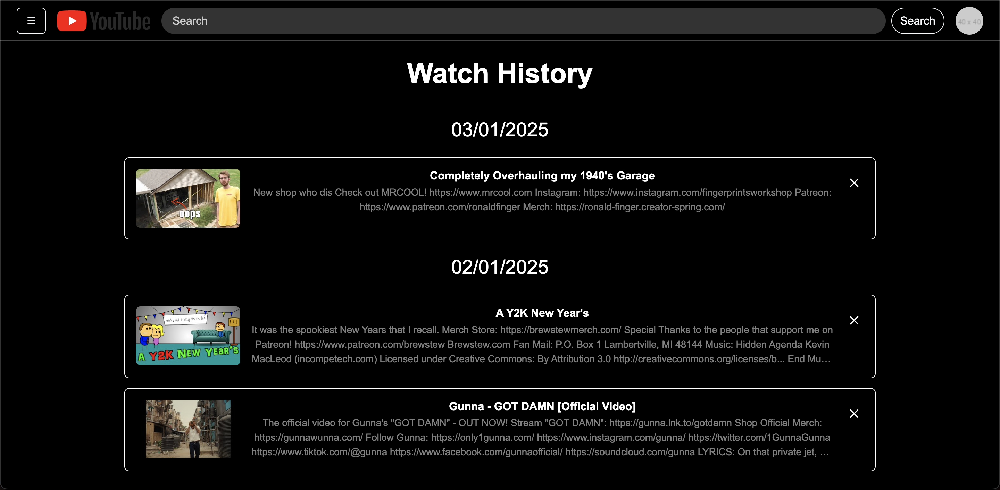

 

## Upload Video Delete Confirmation

  

 